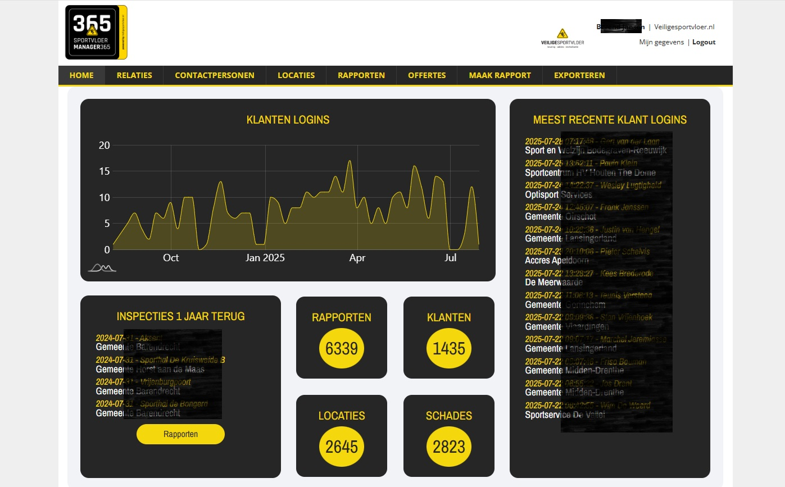
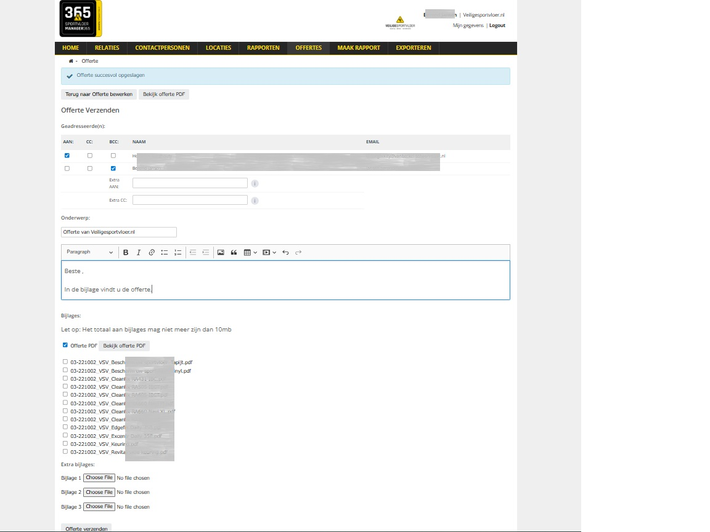
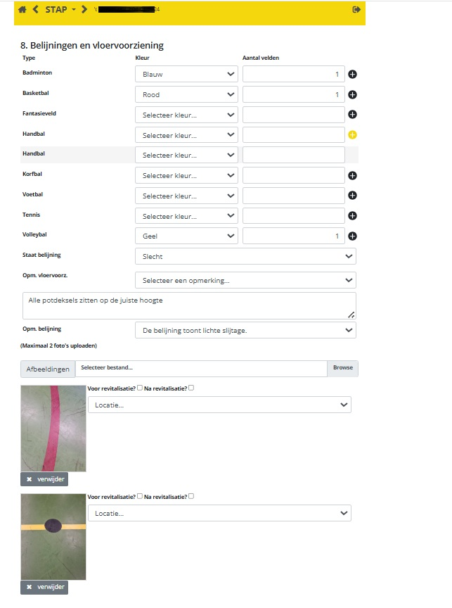
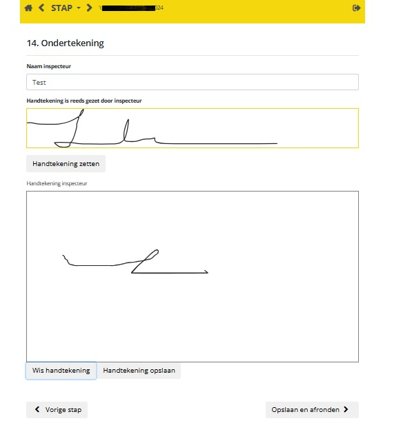
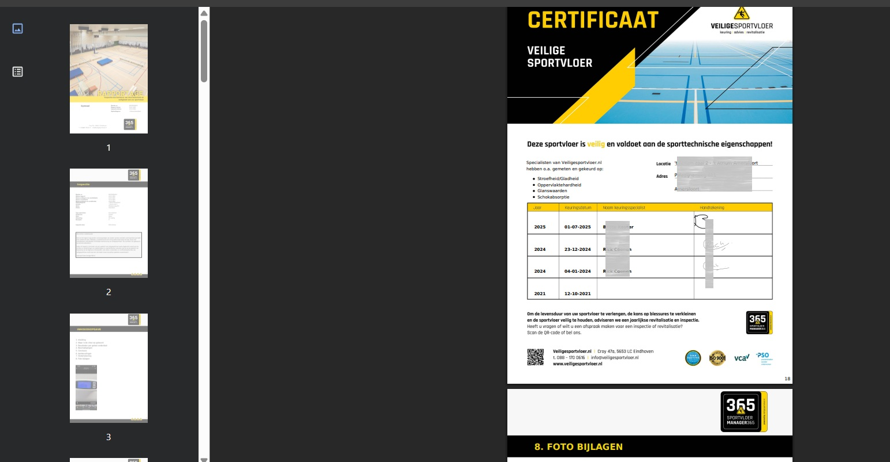

# VSV-project
(Re)developed a webportal for VSV with customer resource, locations and a report module.

#### code snippets
Some code snippets can be found in snippets folder 

#### Images
Images of the portal and report module.  
_private information is sensored_ 

Home page of VSV portal for admins of different companies and customers

Search options and editable content for customers, locations, reports

Mail options for several content (here: Offerte)

Report module for inspectors to insert and update location and report details

Download PDF reports for admin and customers

