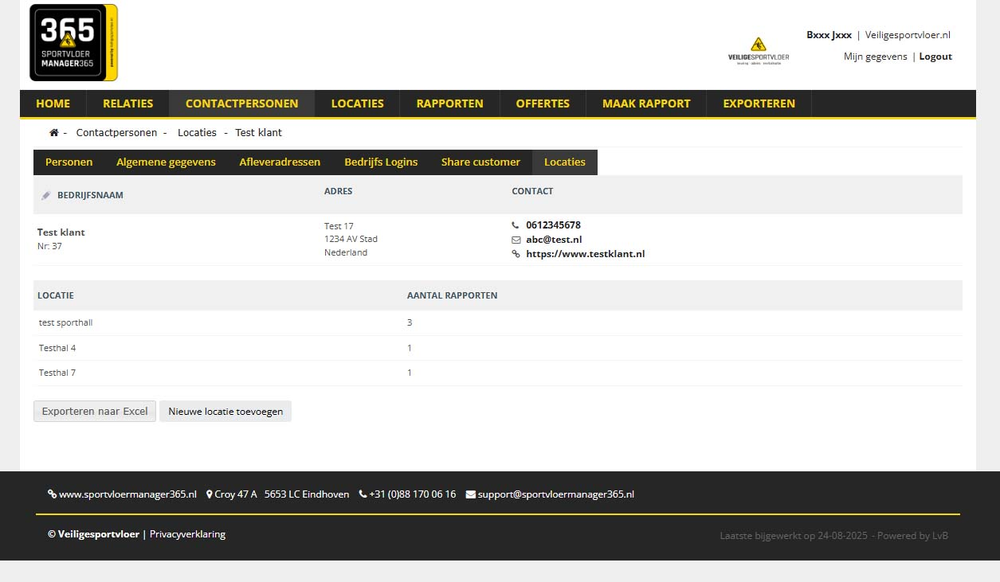

# VSV-project
(Re)developed a webportal for Veiligesportvloer with customer resource, locations and a report module.  
[https://www.sportvloermanager365.nl/](https://www.sportvloermanager365.nl/)

#### Used scripting languages and technologies
PHP 5.3,  
mySQL database,   
javascript/JQuery,   
HTML/CSS,  
WkhtmltoPDF,  
Vue.js / amcharts

#### code snippets in snippets folder 

#### Examples of the portal and report module.  
_private information is sensored_ 

Home page of VSV portal with login system for admins (3 companies) and (shared) customers

Search options and editable content for customers, locations, reports

Mail options (here: Offerte)

Report module for inspectors to insert and update location and report details

Download PDF reports for admin and customers

